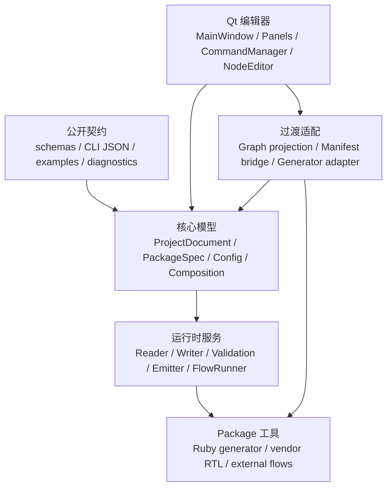
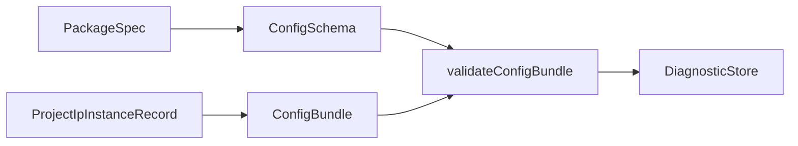

# Finepaper 当前架构设计报告

本文是当前版本的汇报型架构说明，重点回答：Finepaper 现在是什么架构、核心数据模型是什么、内部如何运行、哪些部分仍处于过渡状态。

## 1. 一句话定位

Finepaper 当前是一个以 package contract 驱动的 IP 制作与组合平台。项目由 `ipcraft.project.v1` 表达，IP 能力由 `ipcraft.package.v1` 声明，Qt 画布只是编辑器视图和交互投影，不再是项目语义根。

## 2. 总体架构

## 3. 架构分层

| 层级 | 职责 | 代表模块 |
|------|------|----------|
| 公开契约层 | 对外稳定接口、schema、CLI envelope、诊断规则、示例 | `schemas/`、`examples/contracts/`、`docs/audit/` |
| 项目模型层 | 表达项目、IP 实例、项目连接、布局、诊断、产物 | `ProjectDocument`、`ProjectIpInstanceRecord` |
| Package 契约层 | 描述 package 能力、配置、接口、连接规则、flows、artifacts | `PackageSpec`、`PackageSpecReader` |
| 配置与连接层 | 校验实例配置和项目连接结构 | `ConfigSchema`、`ConfigBundle`、`CompositionModel` |
| 执行层 | 发射输入、运行 flow、收集产物 | `PackageInputBuilder`、`FlowRunner`、`ArtifactCollector` |
| Qt 编辑器层 | 项目编辑、画布、属性、catalog、日志、生成入口 | `MainWindow`、`NodeEditorWidget`、`CommandManager` |
| 过渡适配层 | 把 V1 文档/package spec 投影到现有 UI 和 generator | `GraphProjectSerializer`、`ProjectStateService`、`IpcraftManifestReader` |

## 4. 核心数据模型

| 模型 | 当前作用 |
|------|----------|
| `ProjectDocument` | `.fpproj` 的项目根，保存项目 ID、名称、实例、composition、layout、diagnostics、artifacts、migration。 |
| `ProjectIpInstanceRecord` | 项目内 IP 实例，保存 package ref、config、graphConfig、lastRuns、artifacts、diagnostics、view。 |
| `PackageSpec` | package runtime contract，声明配置、接口、连接规则、emitters、flows、artifacts、views。 |
| `ConfigSchema` | package 声明的配置面。 |
| `ConfigBundle` | 某个 IP 实例保存的实际配置值。 |
| `CompositionModel` | 项目级 IP-to-IP 连接模型，支持 n-ary endpoints。 |
| `GraphConfig` | 单 IP 内部结构配置，不是项目根 graph。 |
| `DiagnosticStore` | 结构化诊断集合，使用稳定 rule id。 |
| `EmittedInputsManifest` | generator 输入发射清单。 |
| `FlowRunResult` | flow 执行结果、manifest、artifacts 和 diagnostics。 |
| `ArtifactIndex` | flow 输出产物索引。 |
| `ProjectDesign` | foundation core 中更干净的长期核心 IR。 |
| `ProjectPatch` | 外部工具或 plugin 修改项目的 patch envelope。 |

## 5. ProjectDocument 设计

`ProjectDocument` 表示当前项目文件。它包含：

- project identity: `projectId`、`projectName`、description、display、metadata
- IP instances: `instances[]`
- project composition: connections、external ports、groups、properties
- editor layout
- diagnostics
- artifacts
- migration state
- native data

当前 `ProjectDocument` 中仍有一些 transitional compile-only 字段，例如旧 `modules`、`connections`、`ipcoreState`。它们用于 Qt 画布兼容和投影，不应被理解为新的长期项目根格式。

## 6. PackageSpec 设计

`PackageSpec` 的职责是描述 package 能力，而不是保存某个实例的运行状态。

它包含：

- identity: `id`、`version`、`name`
- explicit extensions
- config schema
- interface specs
- connection rules
- emitters
- flows
- artifacts
- diagnostics mapping
- view descriptors
- optional plugin metadata
- metadata/native data

运行时加载 package-local `ipcraft.json`。`ipcore.yml` 只属于 authoring/specgen 输入，不是 runtime contract。

## 7. 配置模型

配置模型把“能配什么”和“实际配了什么”拆开：

`ConfigSchema` 支持 parameters、tables、documents、files。`ConfigBundle` 保存 parameters、tables、documents、files、preserved。Core 只检查声明、类型、路径和结构，不检查深层硬件协议语义。

## 8. 连接模型

`CompositionModel` 是项目级连接模型。它不再使用旧画布的二元 `source` / `target` 作为唯一表达，而是使用 endpoint 集合。

一个连接包含：

- `id`
- `type`
- `endpoints[]`
- `source`
- `properties`
- `native`

连接验证依赖 package 声明的 interfaces 和 connection rules。Core 验证浅层结构：实例存在、接口存在、连接类型存在、方向/协议/角色兼容、clock/reset source-count、重复驱动等。

## 9. 内部图与布局

V1 架构把内部图、项目连接、布局拆开：

| 类型 | 所在位置 | 含义 |
|------|----------|------|
| 项目连接 | `composition` | IP 实例之间的语义连接 |
| 单 IP 内部结构 | `instances[].graphConfig` | package-owned internal graph |
| 画布状态 | `layout` 或 `views[].layout` | 坐标、折叠、缩放、waypoints |

Qt 当前仍使用 `Graph` 作为实时画布模型。保存和生成时，系统把 `Graph` 投影回 `ProjectDocument`、`GraphConfig` 和 layout。

## 10. 运行流程

### 打开项目

1. `ProjectReader` 读取 `ipcraft.project.v1`。
2. `ProjectStateService` 加载 `instances[]`。
3. `GraphProjectSerializer` 将过渡 graph 数据投影到 Qt `Graph`。
4. `PackageSpecReader` / `IpcraftManifestReader` 准备 package UI 能力。

### 编辑项目

1. 用户在 catalog、画布、属性面板中操作。
2. UI 把操作封装为 command。
3. `CommandManager` 执行 command 并维护 undo/redo。
4. `Graph` 和 project service 发出变更信号。
5. 面板和画布刷新。

### 保存项目

1. `GraphProjectSerializer` 从当前 `Graph` 生成项目草稿。
2. `ProjectStateService` 写回 canonical instances。
3. GraphConfig 和 layout 写入项目文档。
4. `ProjectWriter` 原子写入。

### 生成项目

1. Qt 或 CLI 解析项目和 package。
2. 静态验证先运行。
3. `PackageInputBuilder` 根据 emitters 发射输入。
4. `FlowRunner` 执行 generate flow。
5. `ArtifactCollector` 收集产物。
6. diagnostics、manifest、artifact index 写回结果。

## 11. CLI / Headless 路径

CLI/headless 直接面向 V1 contract，不依赖 Qt Widgets 或 NodeEditor。

关键命令：

- `inspect-project`
- `validate-project`
- `emit-inputs`
- `run-flow`
- `migrate-project`
- `collect-artifacts`

默认 `validate-project` 是静态无副作用的。外部 generator、DRC、validator、test runner 必须通过 `run-flow` 或 Qt Generate 显式进入执行路径。

## 12. 当前过渡状态

| 区域 | 当前状态 |
|------|----------|
| 项目模型 | `ProjectDocument` 已是项目根方向。 |
| Package runtime | 运行时围绕 `ipcraft.package.v1`。 |
| Qt UI | 仍使用 `Graph` 做实时画布投影。 |
| 命令系统 | 仍以 graph command 为主，后续要收敛到 design service / patch。 |
| Generator | first-party generator 正在从旧 graph input 迁移到 ProjectDesign/tool-input projection。 |
| Foundation core | `ProjectDesign` / `ProjectPatch` 已存在基础 API。 |

## 13. 汇报结论

当前 Finepaper 的架构中心已经完成迁移：项目语义由文档承载，IP 能力由 package contract 承载，连接、配置、诊断、生成和产物都有独立模型。剩余工作主要是消除 Qt `Graph` 和旧 generator 输入的过渡依赖，让 UI mutation、generator input 和外部工具协议完全进入 V1 contract。
