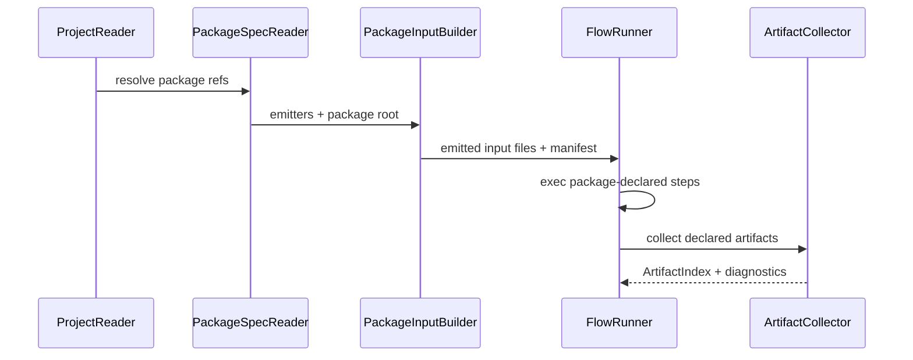

# Finepaper 内部架构设计说明

本文从代码结构角度说明当前 Finepaper 内部如何组织。它比汇报总览更贴近实现模块，适合开发、评审和后续重构对齐。

## 1. 主要代码边界

| 目录 | 当前职责 |
|------|----------|
| `qt/inc/project` / `qt/src/project` | 项目文档、项目读写、IP 实例状态、Qt graph 投影服务。 |
| `qt/inc/ipcraft` / `qt/src/ipcraft` | package contract、config、composition、emitter、flow、artifact、diagnostics。 |
| `qt/inc/ipcraft/core` / `qt/src/ipcraft/core` | foundation ProjectDesign / ProjectPatch API。 |
| `qt/cli` | headless CLI contract。 |
| `qt/inc/app` / `qt/src/app` | Qt 应用启动、主窗口、生成 runner、设置、日志。 |
| `qt/inc/nodeeditor` / `qt/src/nodeeditor` | 当前画布 UI 和 graph projection。 |
| `qt/inc/commands` / `qt/src/commands` | UI mutation command stack。 |
| `qt/inc/panels` / `qt/src/panels` | catalog、property、log 等面板。 |
| `ipcores/*` | first-party package、generator、vendor RTL、package-local views。 |
| `schemas` | public JSON schemas。 |
| `examples/contracts` | public contract examples。 |

## 2. 项目读写模块

核心类型：

- `ProjectDocument`
- `ProjectIpInstanceRecord`
- `ProjectReader`
- `ProjectWriter`
- `ProjectStateService`
- `ProjectIpService`
- `GraphProjectSerializer`

当前职责分配：

| 类型 | 职责 |
|------|------|
| `ProjectDocument` | V1 runtime project root。 |
| `ProjectIpInstanceRecord` | 单个 IP 实例状态。 |
| `ProjectReader` | 读取项目文件并产生 diagnostics。 |
| `ProjectWriter` | 写项目文件，负责写前校验和原子保存。 |
| `ProjectStateService` | Qt 运行时维护 `instances[]` 和实例参数。 |
| `ProjectIpService` | 管理当前项目 IP 实例选择和 UI 状态。 |
| `GraphProjectSerializer` | 在当前 Qt `Graph` 和项目文档之间做过渡投影。 |

设计要点：

- `ProjectDocument.instances` 是实例状态的 canonical 方向。
- `GraphProjectSerializer` 是 adapter，不应成为新的项目语义所有者。
- layout 与 graph config 在保存时拆分，避免 UI 坐标进入硬件配置。

## 3. Package Runtime 模块

核心类型：

- `PackageSpec`
- `PackageSpecReader`
- `PackageInterfaceSpec`
- `PackageConnectionRules`
- `PackageCompatibilityRule`
- `IpcraftManifestReader`
- `IpCatalogService`

职责：

1. `PackageSpecReader` 读取 package-local `ipcraft.json`。
2. `PackageSpec` 保存 package runtime contract。
3. `PackageConnectionRules` 提供连接兼容性数据。
4. `IpcraftManifestReader` 把 `PackageSpec` 桥接为当前 Qt editor 可用的 manifest 形态。
5. `IpCatalogService` 把 package 能力整理成 catalog entries。

关键边界：

- runtime 不应直接依赖 `ipcore.yml`。
- package capability 需要显式 extension。
- package-local path 必须限制在 package root 内。
- plugin metadata 是可选扩展，不是普通 package 接入的必需路径。

## 4. 配置与连接模块

配置相关：

- `ConfigSchema`
- `ConfigBundle`
- `validateConfigBundle`
- `evaluateConfigExpression`

连接相关：

- `CompositionModel`
- `SystemConnection`
- `CompositionEndpointRef`
- `ExternalPort`
- `validateCompositionModel`

设计要点：

- `ConfigSchema` 只声明可配置面。
- `ConfigBundle` 只保存实例值。
- `CompositionModel` 是项目级连接，不是画布边。
- connection compatibility 由 package rules 声明，core 只执行浅层匹配。

## 5. 执行模块

核心类型：

- `PackageInputBuilder`
- `PackageInputBuildRequest`
- `EmittedInputsManifest`
- `FlowRunner`
- `FlowRunRequest`
- `FlowRunResult`
- `ArtifactCollector`
- `ArtifactIndex`

运行顺序：

执行安全由这些模块集中控制：

- 输出路径 confinement
- package-local executable confinement
- stdout/stderr capture limit
- timeout
- environment allowlist
- artifact glob confinement

## 6. Qt 编辑器模块

核心对象：

| 模块 | 内部角色 |
|------|----------|
| `MainWindow` | 应用对象装配点，连接 graph、service、panel、action。 |
| `StartupFlow` | 启动时决定打开项目、创建项目或展示主窗口。 |
| `CommandManager` | undo/redo、dirty state、command 生命周期。 |
| `Graph` | 当前 UI 交互用模型。 |
| `NodeEditorWidget` | 画布 widget 和交互事件处理。 |
| `PropertyPanel` | 参数编辑入口。 |
| `IpCatalogPanel` | package/IP catalog 和 workspace tools 展示。 |
| `LogPanel` | 诊断和运行日志展示。 |
| `ActiveWorkspaceController` | 当前 workspace 的 package / instance / module 上下文。 |
| `ProjectGenerationRunner` | Qt Generate 的执行编排。 |

当前交互链路：

1. 用户操作 UI。
2. UI 创建 command。
3. `CommandManager` 执行 command。
4. `Graph` 或 project service 更新状态。
5. UI 面板刷新。
6. 保存/生成时投影回 V1 project/package/flow 模型。

## 7. Foundation Core 模块

`qt/inc/ipcraft/core` 是更干净的下一阶段核心 IR。主要类型：

- `ProjectDesign`
- `ComponentInstance`
- `InterfaceInstance`
- `Connection`
- `TopologyGraph`
- `TopologyAttachment`
- `ViewDocument`
- `ExtensionBlock`
- `ProjectDocumentV1`
- `ProjectPatch`
- `PatchOperation`

它的设计目标是：

- 不依赖 Qt Widgets、NodeEditor、Graph。
- 不硬编码 NoC / RaveNoC / mesh / router 语义。
- 使用 components、interfaces、connections、topologies、views 表达项目。
- 外部工具通过 `ProjectPatch` 提交修改，由 host 校验后应用。

当前状态是 foundation API 已存在，但 Qt runtime 还没有完全迁入该模型。

## 8. Generator 与 Package 边界

当前 first-party generator 主要位于：

- `ipcores/finepaper-noc/generator`
- `ipcores/opennoc/generator`
- `ipcores/ravenoc/generator`

架构边界要求：

- generator 不应读取 Qt `Graph`。
- generator 不应依赖 `.fpproj` 作为普通输入。
- generator 应消费 package flow 发射出的标准输入投影。
- 旧 graph-shaped input 只能作为 adapter 或 migration fixture。

当前实现仍保留部分兼容 adapter，但方向是统一进入 emitter/tool-input/flow 模型。

## 9. 内部依赖方向

允许方向：

- CLI / Qt app -> project/ipcraft runtime
- project reader/writer -> diagnostics/schema ids
- package reader -> config/composition/diagnostics
- flow/emitter/artifact -> package/config/composition/diagnostics
- Qt editor -> project services + graph projection adapters

不应出现的方向：

- `ipcraft/core` -> Qt Widgets / NodeEditor / Graph
- core model -> concrete NoC package id
- package runtime -> UI layout hardcode
- generator -> `.fpproj` normal runtime schema
- validation -> hidden fixture names or test names

## 10. 当前内部风险

| 风险 | 说明 | 控制方式 |
|------|------|----------|
| Graph 仍在 UI 中强势存在 | 容易把旧模型继续当 domain | 明确 Graph 是 projection，逐步迁入 ProjectDesign / GraphConfig。 |
| registry 桥接仍偏旧 | ModuleRegistry 风格容易形成全局状态 | 后续改为注入式 package/component/interface/rule registry。 |
| generator 输入仍有兼容形态 | 旧 graph schema 可能反向影响新契约 | 只允许边界 normalize，最终消费 tool input。 |
| plugin hook 尚未完整实现 | 契约存在但执行能力有限 | 文档和诊断明确当前限制，后续补执行策略。 |
| parse diagnostics 尚未完整 | 外部工具诊断解析仍需完善 | 保持 flow diagnostic 边界，补 parser registry。 |

## 11. 开发判断准则

新增功能时按以下顺序判断归属：

1. 是项目事实源吗？放入 `ProjectDocument` / `ProjectDesign`。
2. 是 package 能力吗？放入 `PackageSpec`。
3. 是实例配置值吗？放入 `ConfigBundle`。
4. 是项目级连接吗？放入 `CompositionModel`。
5. 是单 IP 内部结构吗？放入 `GraphConfig`。
6. 是视觉布局吗？放入 `layout` / `views`.
7. 是外部工具行为吗？放入 emitter / flow / artifact contract。
8. 是临时 UI 投影吗？放入 adapter，不提升为 public contract。
