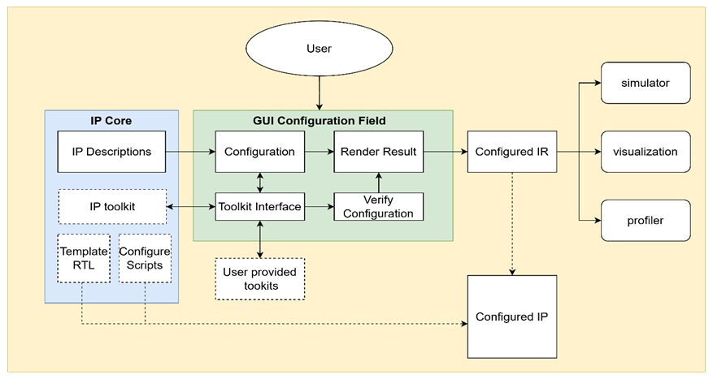
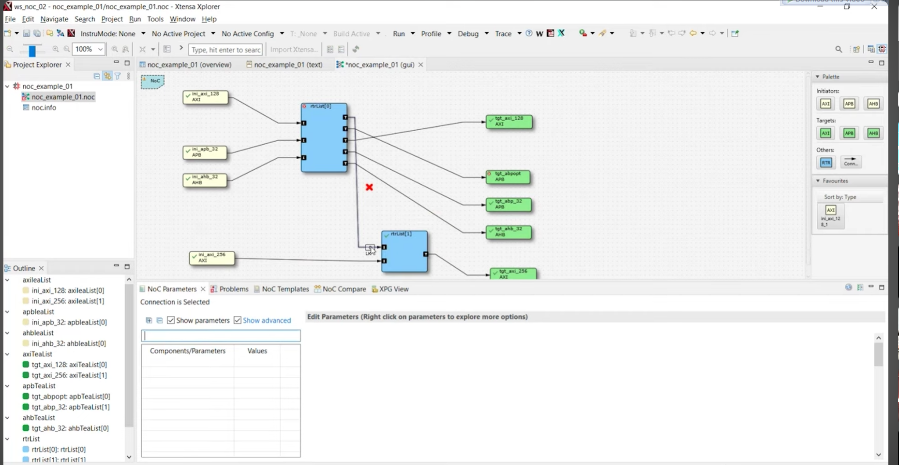
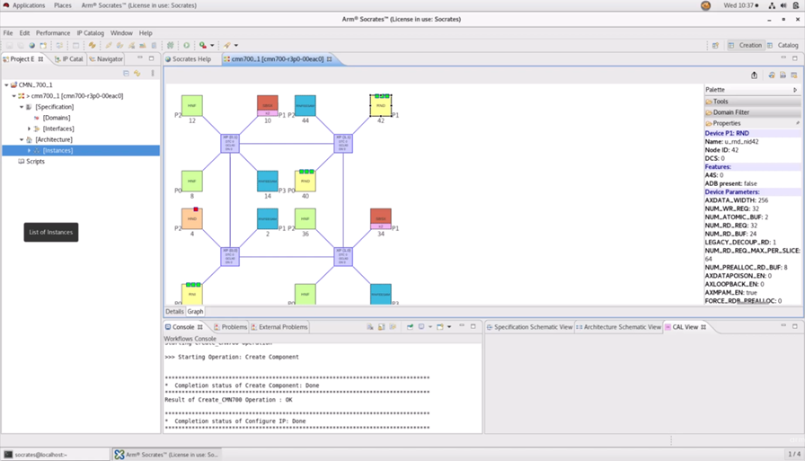

# Main goals
Write a IP configuration frontend under frontend.
The total workflow is the first image.
The configured IR current is a json file ,but format is not defined yet.Use the framework/example scheme to as first stage target.

# First step
Should  can display topology correctly, and assume only mesh topology is supported. Every endpoint can be config while generate.The endpoint current is not have many config, you can reference framework scheme.

Each create, config will use a create wizzard, and current assume current version only support noc.

It ***MUST*** can generate json for framework t use.The framework is not complete yet, so how to call lib current is just use generate script.

# Second Step
add ports for all componenets. The target is second image(example image).
TBD.

# Notes
The highest prioir is complete the visual part instead of data models
this is proto project. we will imgrate to qt-base project in the future.

All reference image is below.
 after upload ,is 1.png

 after upload is 2.png

 after upload is 3.png